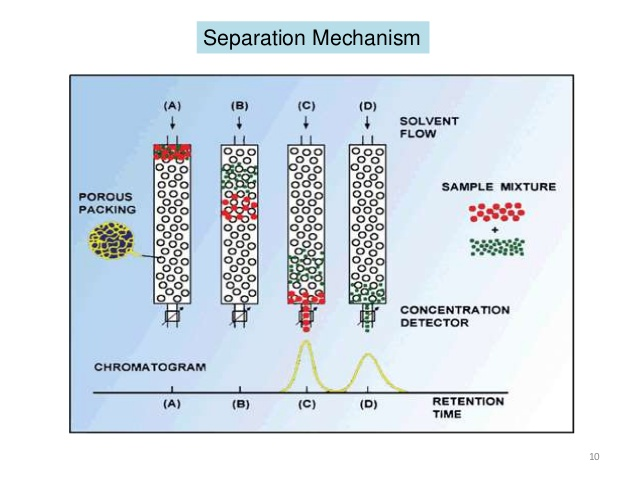

# **Group-1**

## **Gel Permeation**

## **I. Members**

- 余宇恒 (104020006)

- 黃偉誌 (104021230)

- 許孟楷 (104022140)

- 李偉志 (104020010)

## **II. Goal**

1. Create a simple classical model for gel permeation chromatography

## **III. Theoretical Background**

大顆粒子與小顆粒子通過多孔材料所需時間不同

分析一個未知混合物的比例與成分

## **IV. Expected Result**

畫出落下數量vs(時間or路徑)關係圖

## **V. Tasks**

- 設置多孔材料的邊界、障礙物大小、排列、偵測器位置(許孟楷)

- 設置高分子材料初速、位置、環境重力加速度、彈性碰撞(余宇恒、李偉志)

- 畫時間、路徑對位置圖，做成動畫(黃偉誌)

## **VI. Program Setup**

模組:pygame, math, Matplotlib, time, Numpy, random, scipy.optimize, sys

藍色方塊排列模擬多孔材料的排列

橘色球模擬高分子材料

設置均勻向下重力場，並將碰撞情形設為完全彈性碰撞

